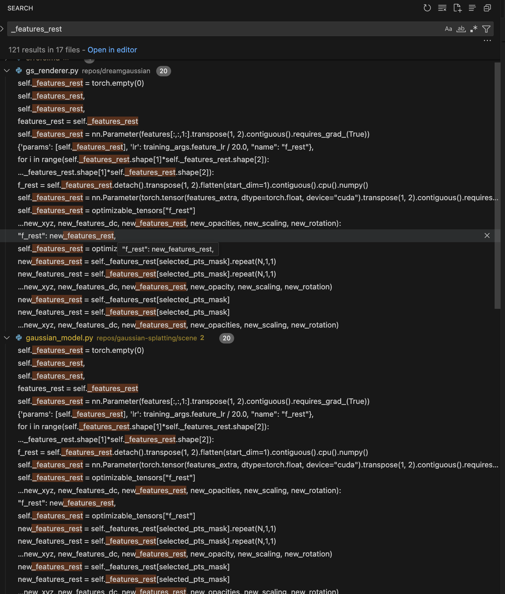

   RuntimeError:
      The detected CUDA version (11.8) mismatches the version that was used to compile
      PyTorch (12.1). Please make sure to use the same CUDA versions.


ERROR: Could not find a version that satisfies the requirement opencv (from versions: none)
ERROR: No matching distribution found for opencv
WARNING: There was an error checking the latest version of pip.


when settigng python to 3.7, installation succeeds; but run fails; python 3.7 does not have Literal from Typing.
When settign python to 3.8 (which supports Literal), installation fails:

× python setup.py bdist_wheel did not run successfully.
  │ exit code: 1
  ╰─> [53 lines of output]
      running bdist_wheel
      running build
      running build_py
      creating build
      creating build/lib.linux-x86_64-cpython-38
      creating build/lib.linux-x86_64-cpython-38/diff_gaussian_rasterization
      copying diff_gaussian_rasterization/__init__.py -> build/lib.linux-x86_64-cpython-38/diff_gaussian_rasterization
      running build_ext
      Traceback (most recent call last):
        File "<string>", line 2, in <module>
        File "<pip-setuptools-caller>", line 34, in <module>
        File "/gpfs/home6/jhuizing/master-thesis-ds/repos/dreamgaussian/diff-gaussian-rasterization/setup.py", line 17, in <module>
          setup(
        File "/home/jhuizing/.conda/envs/dreamgaussian/lib/python3.8/site-packages/setuptools/__init__.py", line 103, in setup
          return distutils.core.setup(**attrs)
        File "/home/jhuizing/.conda/envs/dreamgaussian/lib/python3.8/site-packages/setuptools/_distutils/core.py", line 185, in setup
          return run_commands(dist)
        File "/home/jhuizing/.conda/envs/dreamgaussian/lib/python3.8/site-packages/setuptools/_distutils/core.py", line 201, in run_commands
          dist.run_commands()
        File "/home/jhuizing/.conda/envs/dreamgaussian/lib/python3.8/site-packages/setuptools/_distutils/dist.py", line 969, in run_commands
          self.run_command(cmd)
        File "/home/jhuizing/.conda/envs/dreamgaussian/lib/python3.8/site-packages/setuptools/dist.py", line 989, in run_command
          super().run_command(command)
        File "/home/jhuizing/.conda/envs/dreamgaussian/lib/python3.8/site-packages/setuptools/_distutils/dist.py", line 988, in run_command
          cmd_obj.run()
        File "/home/jhuizing/.conda/envs/dreamgaussian/lib/python3.8/site-packages/wheel/bdist_wheel.py", line 364, in run
          self.run_command("build")
        File "/home/jhuizing/.conda/envs/dreamgaussian/lib/python3.8/site-packages/setuptools/_distutils/cmd.py", line 318, in run_command
          self.distribution.run_command(command)
        File "/home/jhuizing/.conda/envs/dreamgaussian/lib/python3.8/site-packages/setuptools/dist.py", line 989, in run_command
          super().run_command(command)
        File "/home/jhuizing/.conda/envs/dreamgaussian/lib/python3.8/site-packages/setuptools/_distutils/dist.py", line 988, in run_command
          cmd_obj.run()
        File "/home/jhuizing/.conda/envs/dreamgaussian/lib/python3.8/site-packages/setuptools/_distutils/command/build.py", line 131, in run
          self.run_command(cmd_name)
        File "/home/jhuizing/.conda/envs/dreamgaussian/lib/python3.8/site-packages/setuptools/_distutils/cmd.py", line 318, in run_command
          self.distribution.run_command(command)
        File "/home/jhuizing/.conda/envs/dreamgaussian/lib/python3.8/site-packages/setuptools/dist.py", line 989, in run_command
          super().run_command(command)
        File "/home/jhuizing/.conda/envs/dreamgaussian/lib/python3.8/site-packages/setuptools/_distutils/dist.py", line 988, in run_command
          cmd_obj.run()
        File "/home/jhuizing/.conda/envs/dreamgaussian/lib/python3.8/site-packages/setuptools/command/build_ext.py", line 88, in run
          _build_ext.run(self)
        File "/home/jhuizing/.conda/envs/dreamgaussian/lib/python3.8/site-packages/setuptools/_distutils/command/build_ext.py", line 345, in run
          self.build_extensions()
        File "/home/jhuizing/.conda/envs/dreamgaussian/lib/python3.8/site-packages/torch/utils/cpp_extension.py", line 523, in build_extensions
          _check_cuda_version(compiler_name, compiler_version)
        File "/home/jhuizing/.conda/envs/dreamgaussian/lib/python3.8/site-packages/torch/utils/cpp_extension.py", line 414, in _check_cuda_version
          raise RuntimeError(CUDA_MISMATCH_MESSAGE.format(cuda_str_version, torch.version.cuda))
      RuntimeError:
      The detected CUDA version (11.6) mismatches the version that was used to compile
      PyTorch (12.1). Please make sure to use the same CUDA versions.


using cuda 12.1.1 (as 3dgs repo suggests) let dream gaussian setup fail altogether.


using cuda 12.1.1 with python 3.8 will complain about cuda version not set during env install.

note that the nightly of cuda 11.6 is indeed deprecated, explaining previous error when trying to install
that one: https://pytorch.org/blog/deprecation-cuda-python-support/

errors:

https://github.com/pytorch/pytorch/blob/main/RELEASE.md#release-compatibility-matrix


when not specifying python version, installation process will default to 3.12, causing this error:
https://stackoverflow.com/questions/77364550/attributeerror-module-pkgutil-has-no-attribute-impimporter-did-you-mean

specifying python 3.9 cannot resolve dependencies for specified torch version...

python 3.8 cannot find matching scipy version.

https://github.com/dreamgaussian/dreamgaussian/issues/


this works:

```bash
#!/bin/bash

#SBATCH --partition=gpu
#SBATCH --gpus=1
#SBATCH --job-name=InstallEnvironment
#SBATCH --ntasks=1
#SBATCH --cpus-per-task=18
#SBATCH --time=04:00:00
#SBATCH --output=slurm_output_%A.out

module purge
# module load 2021 // although spider says we need 2021 for cuda 11.6, the partition does not support 2021..
module load 2022
module load CUDA/11.8.0
module load Anaconda3/2022.05

cd $HOME/master-thesis-ds/
git pull

cd $HOME/master-thesis-ds/repos/dreamgaussian
# conda env remove --name dreamgaussian
conda create -n dreamgaussian python=3.8 pip
source activate dreamgaussian

conda install pytorch==2.1.0 torchvision==0.16.0 torchaudio==2.1.0 pytorch-cuda=11.8 -c pytorch -c nvidia

pip install -r requirements.txt

# a modified gaussian splatting (+ depth, alpha rendering)
git clone --recursive https://github.com/ashawkey/diff-gaussian-rasterization
pip install ./diff-gaussian-rasterization

# simple-knn
pip install ./simple-knn

# nvdiffrast
pip install git+https://github.com/NVlabs/nvdiffrast/

# kiuikit
pip install git+https://github.com/ashawkey/kiuikit

# To use MVdream, also install:
pip install git+https://github.com/bytedance/MVDream

# To use ImageDream, also install:
pip install git+https://github.com/bytedance/ImageDream/#subdirectory=extern/ImageDream


```


But now running the training loop gives an error, indicating the linux version we use is too old..
Which we cannot easily update.

```error
Traceback (most recent call last):
  File "main.py", line 6, in <module>
    import dearpygui.dearpygui as dpg
  File "/home/jhuizing/.conda/envs/dreamgaussian/lib/python3.8/site-packages/dearpygui/dearpygui.py", line 22, in <module>
    import dearpygui._dearpygui as internal_dpg
ImportError: /lib64/libm.so.6: version `GLIBC_2.29' not found (required by /home/jhuizing/.conda/envs/dreamgaussian/lib/python3.8/site-packages/dearpygui/_dearpygui.so)
Traceback (most recent call last):
  File "main2.py", line 6, in <module>
    import dearpygui.dearpygui as dpg
  File "/home/jhuizing/.conda/envs/dreamgaussian/lib/python3.8/site-packages/dearpygui/dearpygui.py", line 22, in <module>
    import dearpygui._dearpygui as internal_dpg
ImportError: /lib64/libm.so.6: version `GLIBC_2.29' not found (required by /home/jhuizing/.conda/envs/dreamgaussian/lib/python3.8/site-packages/dearpygui/_dearpygui.so)
Traceback (most recent call last):
  File "/home/jhuizing/.conda/envs/dreamgaussian/bin/kire", line 8, in <module>
    sys.exit(main())
  File "/home/jhuizing/.conda/envs/dreamgaussian/lib/python3.8/site-packages/kiui/render.py", line 431, in main
    gui = GUI(opt)
  File "/home/jhuizing/.conda/envs/dreamgaussian/lib/python3.8/site-packages/kiui/render.py", line 44, in __init__
    self.mesh = Mesh.load(opt.mesh, front_dir=opt.front_dir)
  File "/home/jhuizing/.conda/envs/dreamgaussian/lib/python3.8/site-packages/kiui/mesh.py", line 96, in load
    mesh = cls.load_obj(path, **kwargs)
  File "/home/jhuizing/.conda/envs/dreamgaussian/lib/python3.8/site-packages/kiui/mesh.py", line 182, in load_obj
    with open(path, "r") as f:
FileNotFoundError: [Errno 2] N
```


Stackoverflow suggests this can be solved by using conda-forage... but
When trying to isntall via conda environment, solving environment takes forever:
https://stackoverflow.com/questions/63734508/stuck-at-solving-environment-on-anaconda


We could actually solve it by removing all references to dearpygui in main.py (main2.py still todo);
It is just likely that a non-gui system like snellius us running a disto of ubuntu that does not support 
dearpy gui dependencies.


Now we run into: 
```error:
Traceback (most recent call last):
  File "main.py", line 616, in <module>
    gui.train(opt.iters)
  File "main.py", line 597, in train
    self.save_model(mode='geo+tex')
  File "/home/jhuizing/.conda/envs/dreamgaussian/lib/python3.8/site-packages/torch/utils/_contextlib.py", line 115, in decorate_context
    return func(*args, **kwargs)
  File "main.py", line 404, in save_model
    mesh = self.renderer.gaussians.extract_mesh(path, self.opt.density_thresh)
  File "/gpfs/home6/jhuizing/master-thesis-ds/repos/dreamgaussian/gs_renderer.py", line 309, in extract_mesh
    vertices, triangles = clean_mesh(vertices, triangles, remesh=True, remesh_size=0.015)
  File "/gpfs/home6/jhuizing/master-thesis-ds/repos/dreamgaussian/mesh_utils.py", line 113, in clean_mesh
    threshold=pml.PercentageValue(v_pct)
AttributeError: module 'pymeshlab' has no attribute 'PercentageValue'
```
we do not seem to be the only one: https://github.com/dreamgaussian/dreamgaussian/issues/35


Why would you even define requirements if your code does not comply...? Jeez.


We can fix this by running

```bash
pip install pymeshlab==0.2
```

after activivating the env but before running the training loop. However, now we get:


```error
AttributeError: 'pymeshlab.pmeshlab.MeshSet' object has no attribute 'meshing_remove_unreferenced_vertices'
```

running "conda update pymeshlab" instead does not work as it will complain the conda env does not have that package installed, prob bc we installed everything using pip??


running "conda install pymeshlabl" will give:

```error
PackagesNotFoundError: The following packages are not available from current channels:

  - pymeshlab

Current channels:

  - https://repo.anaconda.com/pkgs/main/linux-64
  - https://repo.anaconda.com/pkgs/main/noarch
  - https://repo.anaconda.com/pkgs/r/linux-64
  - https://repo.anaconda.com/pkgs/r/noarch

```

running "pip install pymeshlab==2022.02" will give error again:

```error
AttributeError: module 'pymeshlab' has no attribute 'PercentageValue'
```

we can fix all pyhmeshlab related errors by doing a clean install of the environment and monkey patching the the mesh_utils.py file as follows, so it uses other method names: https://github.com/3DTopia/LGM/issues/2


>! NOTE: probably everything would also be fixed by using pymeshlab 2023.12, as defined in the dreamgaussian requirements.lock.txt. However, it seems we cannot easily install that version of Pymeshlab on our particular partition (genoa) of Snellius... But also not sure what pymeshlab version we are actually using now... ow do we check that?#TODO. 


Mesh creation seems to succeed, but then loading mesh at next step gives runtime error:

```error

AttributeError: 'Namespace' object has no attribute 'ssaa'

```


This is a bug, recently introduced, in the kiui package. We can fix this by ensuring we use a version before the bug was introduced. With the conda env activated, run:

```bash
pip install kiui==0.2.2
```

and hey, we can finally compute clip scores.


# LGM installation

Following their README instructions, we get:

```error
equirement already satisfied: mpmath>=0.19 in /gpfs/home6/jhuizing/.conda/envs/lgm/lib/python3.8/site-packages (from sympy->torch==2.2.2->xformers) (1.3.0)
Installing collected packages: triton, nvidia-nvtx-cu11, nvidia-nccl-cu11, nvidia-cusparse-cu11, nvidia-curand-cu11, nvidia-cufft-cu11, nvidia-cuda-runtime-cu11, nvidia-cuda-nvrtc-cu11, nvidia-cuda-cupti-cu11, nvidia-cublas-cu11, nvidia-cusolver-cu11, nvidia-cudnn-cu11, torch, xformers
  Attempting uninstall: triton
    Found existing installation: triton 2.1.0
    Uninstalling triton-2.1.0:
      Successfully uninstalled triton-2.1.0
  Attempting uninstall: torch
    Found existing installation: torch 2.1.0+cu118
    Uninstalling torch-2.1.0+cu118:
      Successfully uninstalled torch-2.1.0+cu118
ERROR: pip's dependency resolver does not currently take into account all the packages that are installed. This behaviour is the source of the following dependency conflicts.
torchaudio 2.1.0+cu118 requires torch==2.1.0, but you have torch 2.2.2+cu118 which is incompatible.
torchvision 0.16.0+cu118 requires torch==2.1.0, but you have torch 2.2.2+cu118 which is incompatible.
Successfully installed nvidia-cublas-cu11-11.11.3.6 nvidia-cuda-cupti-cu11-11.8.87 nvidia-cuda-nvrtc-cu11-11.8.89 nvidia-cuda-runtime-cu11-11.8.89 nvidia-cudnn-cu11-8.7.0.84 nvidia-cufft-cu11-10.9.0.58 nvidia-curand-cu11-10.3.0.86 nvidia-cusolver-cu11-11.4.1.48 nvidia-cusparse-cu11-11.7.5.86 nvidia-nccl-cu11-2.19.3 nvidia-nvtx-cu11-11.8.86 torch-2.2.2+cu118 triton-2.2.0 xformers-0.0.25.post1+cu118
Cloning into 'diff-gaussian-rasterization'...
Submodule 'third_party/glm' (https://github.com/g-truc/glm.git) registered for path 'third_party/glm'
Cloning into '/gpfs/home6/jhuizing/master-thesis-ds/repos/LGM/diff-gaussian-rasterization/third_party/glm'...
Submodule path 'third_party/glm': checked out '5c46b9c07008ae65cb81ab79cd677ecc1934b903'
Processing ./diff-gaussian-rasterization
  Preparing metadata (setup.py): started
  Preparing metadata (setup.py): finished with status 'done'
Building wheels for collected packages: diff-gaussian-rasterization
  Building wheel for diff-gaussian-rasterization (setup.py): started
  Building wheel for diff-gaussian-rasterization (setup.py): finished with status 'error'
  error: subprocess-exited-with-error
  
  × python setup.py bdist_wheel did not run successfully.
  │ exit code: 1
  ╰─> [134 lines of output]
      running bdist_wheel
      running build
      running build_py
      creating build
      creating build/lib.linux-x86_64-cpython-38
      creating build/lib.linux-x86_64-cpython-38/diff_gaussian_rasterization
      copying diff_gaussian_rasterization/__init__.py -> build/lib.linux-x86_64-cpython-38/diff_gaussian_rasterization
      running build_ext
      /home/jhuizing/.conda/envs/lgm/lib/python3.8/site-packages/torch/utils/cpp_extension.py:425: UserWarning: There are no g++ version bounds defined for CUDA version 11.8
        warnings.warn(f'There are no {compiler_name} version bounds defined for CUDA version {cuda_str_version}')
      building 'diff_gaussian_rasterization._C' extension
      creating /gpfs/home6/jhuizing/master-thesis-ds/repos/LGM/diff-gaussian-rasterization/build/temp.linux-x86_64-cpython-38
      creating /gpfs/home6/jhuizing/master-thesis-ds/repos/LGM/diff-gaussian-rasterization/build/temp.linux-x86_64-cpython-38/cuda_rasterizer
      Emitting ninja build file /gpfs/home6/jhuizing/master-thesis-ds/repos/LGM/diff-gaussian-rasterization/build/temp.linux-x86_64-cpython-38/build.ninja...
      Compiling objects...
      Allowing ninja to set a default number of workers... (overridable by setting the environment variable MAX_JOBS=N)
      [1/5] /sw/arch/RHEL8/EB_production/2022/software/CUDA/11.8.0/bin/nvcc --generate-dependencies-with-compile --dependency-output /gpfs/home6/jhuizing/master-thesis-ds/repos/LGM/diff-gaussian-rasterization/build/temp.linux-x86_64-cpython-38/rasterize_points.o.d -I/home/jhuizing/.conda/envs/lgm/lib/python3.8/site-packages/torch/include -I/home/jhuizing/.conda/envs/lgm/lib/python3.8/site-packages/torch/include/torch/csrc/api/include -I/home/jhuizing/.conda/envs/lgm/lib/python3.8/site-packages/torch/include/TH -I/home/jhuizing/.conda/envs/lgm/lib/python3.8/site-packages/torch/include/THC -I/sw/arch/RHEL8/EB_production/2022/software/CUDA/11.8.0/include -I/home/jhuizing/.conda/envs/lgm/include/python3.8 -c -c /gpfs/home6/jhuizing/master-thesis-ds/repos/LGM/diff-gaussian-rasterization/rasterize_points.cu -o /gpfs/home6/jhuizing/master-thesis-ds/repos/LGM/diff-gaussian-rasterization/build/temp.linux-x86_64-cpython-38/rasterize_points.o -D__CUDA_NO_HALF_OPERATORS__ -D__CUDA_NO_HALF_CONVERSIONS__ -D__CUDA_NO_BFLOAT16_CONVERSIONS__ -D__CUDA_NO_HALF2_OPERATORS__ --expt-relaxed-constexpr --compiler-options ''"'"'-fPIC'"'"'' -I/gpfs/home6/jhuizing/master-thesis-ds/repos/LGM/diff-gaussian-rasterization/third_party/glm/ -DTORCH_API_INCLUDE_EXTENSION_H '-DPYBIND11_COMPILER_TYPE="_gcc"' '-DPYBIND11_STDLIB="_libstdcpp"' '-DPYBIND11_BUILD_ABI="_cxxabi1011"' -DTORCH_EXTENSION_NAME=_C -D_GLIBCXX_USE_CXX11_ABI=0 -gencode=arch=compute_80,code=compute_80 -gencode=arch=compute_80,code=sm_80 -std=c++17
      FAILED: /gpfs/home6/jhuizing/master-thesis-ds/repos/LGM/diff-gaussian-rasterization/build/temp.linux-x86_64-cpython-38/rasterize_points.o
      /sw/arch/RHEL8/EB_production/2022/software/CUDA/11.8.0/bin/nvcc --generate-dependencies-with-compile --dependency-output /gpfs/home6/jhuizing/master-thesis-ds/repos/LGM/diff-gaussian-rasterization/build/temp.linux-x86_64-cpython-38/rasterize_points.o.d -I/home/jhuizing/.conda/envs/lgm/lib/python3.8/site-packages/torch/include -I/home/jhuizing/.conda/envs/lgm/lib/python3.8/site-packages/torch/include/torch/csrc/api/include -I/home/jhuizing/.conda/envs/lgm/lib/python3.8/site-packages/torch/include/TH -I/home/jhuizing/.conda/envs/lgm/lib/python3.8/site-packages/torch/include/THC -I/sw/arch/RHEL8/EB_production/2022/software/CUDA/11.8.0/include -I/home/jhuizing/.conda/envs/lgm/include/python3.8 -c -c /gpfs/home6/jhuizing/master-thesis-ds/repos/LGM/diff-gaussian-rasterization/rasterize_points.cu -o /gpfs/home6/jhuizing/master-thesis-ds/repos/LGM/diff-gaussian-rasterization/build/temp.linux-x86_64-cpython-38/rasterize_points.o -D__CUDA_NO_HALF_OPERATORS__ -D__CUDA_NO_HALF_CONVERSIONS__ -D__CUDA_NO_BFLOAT16_CONVERSIONS__ -D__CUDA_NO_HALF2_OPERATORS__ --expt-relaxed-constexpr --compiler-options ''"'"'-fPIC'"'"'' -I/gpfs/home6/jhuizing/master-thesis-ds/repos/LGM/diff-gaussian-rasterization/third_party/glm/ -DTORCH_API_INCLUDE_EXTENSION_H '-DPYBIND11_COMPILER_TYPE="_gcc"' '-DPYBIND11_STDLIB="_libstdcpp"' '-DPYBIND11_BUILD_ABI="_cxxabi1011"' -DTORCH_EXTENSION_NAME=_C -D_GLIBCXX_USE_CXX11_ABI=0 -gencode=arch=compute_80,code=compute_80 -gencode=arch=compute_80,code=sm_80 -std=c++17
      In file included from /home/jhuizing/.conda/envs/lgm/lib/python3.8/site-packages/torch/include/c10/util/TypeList.h:3,
                       from /home/jhuizing/.conda/envs/lgm/lib/python3.8/site-packages/torch/include/c10/util/Metaprogramming.h:3,
                       from /home/jhuizing/.conda/envs/lgm/lib/python3.8/site-packages/torch/include/c10/core/DispatchKeySet.h:4,
                       from /home/jhuizing/.conda/envs/lgm/lib/python3.8/site-packages/torch/include/c10/core/Backend.h:5,
                       from /home/jhuizing/.conda/envs/lgm/lib/python3.8/site-packages/torch/include/c10/core/Layout.h:3,
                       from /home/jhuizing/.conda/envs/lgm/lib/python3.8/site-packages/torch/include/ATen/core/TensorBody.h:12,
                       from /home/jhuizing/.conda/envs/lgm/lib/python3.8/site-packages/torch/include/ATen/core/Tensor.h:3,
                       from /home/jhuizing/.conda/envs/lgm/lib/python3.8/site-packages/torch/include/ATen/Tensor.h:3,
                       from /home/jhuizing/.conda/envs/lgm/lib/python3.8/site-packages/torch/include/torch/csrc/autograd/function_hook.h:3,
                       from /home/jhuizing/.conda/envs/lgm/lib/python3.8/site-packages/torch/include/torch/csrc/autograd/cpp_hook.h:2,
                       from /home/jhuizing/.conda/envs/lgm/lib/python3.8/site-packages/torch/include/torch/csrc/autograd/variable.h:6,
                       from /home/jhuizing/.conda/envs/lgm/lib/python3.8/site-packages/torch/include/torch/csrc/autograd/autograd.h:3,
                       from /home/jhuizing/.conda/envs/lgm/lib/python3.8/site-packages/torch/include/torch/csrc/api/include/torch/autograd.h:3,
                       from /home/jhuizing/.conda/envs/lgm/lib/python3.8/site-packages/torch/include/torch/csrc/api/include/torch/all.h:7,
                       from /home/jhuizing/.conda/envs/lgm/lib/python3.8/site-packages/torch/include/torch/extension.h:5,
                       from /gpfs/home6/jhuizing/master-thesis-ds/repos/LGM/diff-gaussian-rasterization/rasterize_points.cu:13:
      /home/jhuizing/.conda/envs/lgm/lib/python3.8/site-packages/torch/include/c10/util/C++17.h:16:2: error: #error "You're trying to build PyTorch with a too old version of GCC. We need GCC 9 or later."
       #error \
        ^~~~~
      [2/5] /sw/arch/RHEL8/EB_production/2022/software/CUDA/11.8.0/bin/nvcc --generate-dependencies-with-compile --dependency-output /gpfs/home6/jhuizing/master-thesis-ds/repos/LGM/diff-gaussian-rasterization/build/temp.linux-x86_64-cpython-38/cuda_rasterizer/forward.o.d -I/home/jhuizing/.conda/envs/lgm/lib/python3.8/site-packages/torch/include -I/home/jhuizing/.conda/envs/lgm/lib/python3.8/site-packages/torch/include/torch/csrc/api/include -I/home/jhuizing/.conda/envs/lgm/lib/python3.8/site-packages/torch/include/TH -I/home/jhuizing/.conda/envs/lgm/lib/python3.8/site-packages/torch/include/THC -I/sw/arch/RHEL8/EB_production/2022/software/CUDA/11.8.0/include -I/home/jhuizing/.conda/envs/lgm/include/python3.8 -c -c /gpfs/home6/jhuizing/master-thesis-ds/repos/LGM/diff-gaussian-rasterization/cuda_rasterizer/forward.cu -o /gpfs/home6/jhuizing/master-thesis-ds/repos/LGM/diff-gaussian-rasterization/build/temp.linux-x86_64-cpython-38/cuda_rasterizer/forward.o -D__CUDA_NO_HALF_OPERATORS__ -D__CUDA_NO_HALF_CONVERSIONS__ -D__CUDA_NO_BFLOAT16_CONVERSIONS__ -D__CUDA_NO_HALF2_OPERATORS__ --expt-relaxed-constexpr --compiler-options ''"'"'-fPIC'"'"'' -I/gpfs/home6/jhuizing/master-thesis-ds/repos/LGM/diff-gaussian-rasterization/third_party/glm/ -DTORCH_API_INCLUDE_EXTENSION_H '-DPYBIND11_COMPILER_TYPE="_gcc"' '-DPYBIND11_STDLIB="_libstdcpp"' '-DPYBIND11_BUILD_ABI="_cxxabi1011"' -DTORCH_EXTENSION_NAME=_C -D_GLIBCXX_USE_CXX11_ABI=0 -gencode=arch=compute_80,code=compute_80 -gencode=arch=compute_80,code=sm_80 -std=c++17
      /gpfs/home6/jhuizing/master-thesis-ds/repos/LGM/diff-gaussian-rasterization/cuda_rasterizer/auxiliary.h(151): warning #177-D: variable "p_proj" was declared but never referenced
      

```

We can get  sucessful install of the env by changing the order of installing dependencies:

```bash
#!/bin/bash

#SBATCH --partition=gpu
#SBATCH --gpus=1
#SBATCH --job-name=InstallEnvironment
#SBATCH --ntasks=1
#SBATCH --cpus-per-task=18
#SBATCH --time=04:00:00
#SBATCH --output=slurm_output_%A.out

module purge
module load 2022
module load CUDA/11.8.0
module load Anaconda3/2022.05

cd $HOME/master-thesis-ds/

git pull || true # do not exit if pull fails for some reason.

cd $HOME/master-thesis-ds/repos/LGM
conda env remove --name lgm
conda create -n lgm python=3.8 pip
source activate lgm


conda install pytorch==2.1.0 torchvision==0.16.0 torchaudio==2.1.0 pytorch-cuda=11.8 -c pytorch -c nvidia
git clone --recursive https://github.com/ashawkey/diff-gaussian-rasterization
pip install ./diff-gaussian-rasterization


# for mesh extraction
pip install git+https://github.com/NVlabs/nvdiffrast

pip install -U xformers --index-url https://download.pytorch.org/whl/cu118


# other requirements
pip install -r requirements.txt


```


But when running:

```bash
#!/bin/bash

#SBATCH --partition=gpu
#SBATCH --gpus=1
#SBATCH --job-name=RunDreamGaussian
#SBATCH --ntasks=1
#SBATCH --cpus-per-task=18
#SBATCH --time=04:00:00
#SBATCH --output=../logs/slurm_output_%A.out

module purge
module load 2022
module load CUDA/11.8.0
module load Anaconda3/2022.05

cd $HOME/master-thesis-ds/
git pull

cd $HOME/master-thesis-ds/repos/lgm

source activate lgm
python infer.py big --workspace workspace_test --resume workspace/model.safetensors --test_path data_test

```
we get:

```error
/home/jhuizing/.conda/envs/lgm/lib/python3.8/site-packages/torchvision/io/image.py:13: UserWarning: Failed to load image Python extension: '/gpfs/home6/jhuizing/.conda/envs/lgm/lib/python3.8/site-packages/torchvision/image.so: undefined symbol: _ZN3c1017RegisterOperatorsD1Ev'If you don't plan on using image functionality from `torchvision.io`, you can ignore this warning. Otherwise, there might be something wrong with your environment. Did you have `libjpeg` or `libpng` installed before building `torchvision` from source?
  warn(
/gpfs/home6/jhuizing/master-thesis-ds/repos/LGM/core/attention.py:22: UserWarning: xFormers is available (Attention)
  warnings.warn("xFormers is available (Attention)")
Traceback (most recent call last):
  File "infer.py", line 20, in <module>
    from core.models import LGM
  File "/gpfs/home6/jhuizing/master-thesis-ds/repos/LGM/core/models.py", line 11, in <module>
    from core.gs import GaussianRenderer
  File "/gpfs/home6/jhuizing/master-thesis-ds/repos/LGM/core/gs.py", line 7, in <module>
    from diff_gaussian_rasterization import (
  File "/home/jhuizing/.conda/envs/lgm/lib/python3.8/site-packages/diff_gaussian_rasterization/__init__.py", line 15, in <module>
    from . import _C
ImportError: /home/jhuizing/.conda/envs/lgm/lib/python3.8/site-packages/diff_gaussian_rasterization/_C.cpython-38-x86_64-linux-gnu.so: undefined symbol: _ZN2at4_ops5zeros4callEN3c108ArrayRefINS2_6SymIntEEENS2_8optionalINS2_10ScalarTypeEEENS6_INS2_6LayoutEEENS6_INS2_6DeviceEEENS6_IbEE
```


Sugars env can be isntalled without errors, but get this runtime error when running the instlal_sugar_job:

```error
Traceback (most recent call last):
  File "/gpfs/home6/jhuizing/master-thesis-ds/repos/SuGaR/train.py", line 3, in <module>
    from sugar_trainers.coarse_density import coarse_training_with_density_regularization
  File "/gpfs/home6/jhuizing/master-thesis-ds/repos/SuGaR/sugar_trainers/coarse_density.py", line 5, in <module>
    from pytorch3d.loss import mesh_laplacian_smoothing, mesh_normal_consistency
  File "/home/jhuizing/.conda/envs/sugar2/lib/python3.9/site-packages/pytorch3d/loss/__init__.py", line 8, in <module>
    from .chamfer import chamfer_distance
  File "/home/jhuizing/.conda/envs/sugar2/lib/python3.9/site-packages/pytorch3d/loss/chamfer.py", line 11, in <module>
    from pytorch3d.ops.knn import knn_gather, knn_points
  File "/home/jhuizing/.conda/envs/sugar2/lib/python3.9/site-packages/pytorch3d/ops/__init__.py", line 7, in <module>
    from .ball_query import ball_query
  File "/home/jhuizing/.conda/envs/sugar2/lib/python3.9/site-packages/pytorch3d/ops/ball_query.py", line 10, in <module>
    from pytorch3d import _C
ImportError: /home/jhuizing/.conda/envs/sugar2/lib/python3.9/site-packages/pytorch3d/_C.cpython-39-x86_64-linux-gnu.so: undefined symbol: _ZN2at4_ops10zeros_like4callERKNS_6TensorEN3c108optionalINS5_10ScalarTypeEEENS6_INS5_6LayoutEEENS6_INS5_6DeviceEEENS6_IbEENS6_INS5_12MemoryFormatEEE
```


using python 3.8 leads to a failure when trying to solve the envrionment...

https://github.com/facebookresearch/pytorch3d/blob/main/INSTALL.md

But, Again, we don't seem alone:

https://github.com/Anttwo/SuGaR/issues/136

but applying this pip install inside the activated env leads to yet another error:

```error 
UserWarning: The environment variable `CUB_HOME` was not found. NVIDIA CUB is required for compilation and can be downloaded from `https://github.com/NVIDIA/cub/releases`. You can unpack it to a location of your choice and set the environment variable `CUB_HOME` to the folder containing the `CMakeListst.txt` file.

```

Inspecting this issue page: https://github.com/facebookresearch/pytorch3d/blob/main/INSTALL.md

indeeds points out that for Cuda >= 11.8 (which we use and which the environment.yyml of SuGAr defines as requirement) the CUB library needs to be available...

perhaps check:
https://github.com/facebookresearch/pytorch3d/issues/1207


Using this pip install "git+https://github.com/facebookresearch/pytorch3d.git@stable"

Inside the job does give yet another error again, this time complaining that the cuda versions don't match. However, we also saw this problem within the DG framework, which we could solve by also pip installing a specific version of Cuda.. (even though the environmnent.yaml defines it...)


Now we seem to run into this error, in the actual 

So apparantly, the sugar framework expects the original gaussian splatting framework as dependency (i.e. its knn and rasterizaiton submodules), although it does not define that in the environment.yaml.

so we prepend with:

pip install gaussian_splatting/simple-knn
pip install gaussian_splatting/diff-gaussian-rasterization


we can now run, but get the run time after a very while:


```error
-----Foreground mesh-----

[WARNING] Foreground is empty.

-----Background mesh-----

[WARNING] Background is empty.
Finished computing meshes.
Foreground mesh: None
Background mesh: None

-----Decimating and cleaning meshes-----

Processing decimation target: 1000000
Cleaning mesh...
Traceback (most recent call last):
  File "/gpfs/home6/jhuizing/master-thesis-ds/repos/SuGaR/train.py", line 152, in <module>
    coarse_mesh_path = extract_mesh_from_coarse_sugar(coarse_mesh_args)[0]
  File "/gpfs/home6/jhuizing/master-thesis-ds/repos/SuGaR/sugar_extractors/coarse_mesh.py", line 475, in extract_mesh_from_coarse_sugar
    raise ValueError("Both foreground and background meshes are empty. Please provide a valid bounding box for the scene.")
ValueError: Both foreground and background meshes are empty. Please provide a valid bounding box for the scene.


```

This might be because our colmap is so sparse...


# Installing MVC Env for using Sugar...
"/gpfs/home6/jhuizing/master-thesis-ds/repos/MVControl-threestudio/./threestudio/utils/__init__.py", line 1, in <module>
    from . import base
  File "/gpfs/home6/jhuizing/master-thesis-ds/repos/MVControl-threestudio/./threestudio/utils/base.py", line 7, in <module>
    from threestudio.utils.misc import get_device, load_module_weights
  File "/gpfs/home6/jhuizing/master-thesis-ds/repos/MVControl-threestudio/./threestudio/utils/misc.py", line 6, in <module>
    import tinycudann as tcnn
ModuleNotFoundError: No module named 'tinycudann'


 The following will give the error during the pytorch3d installation step:

 ```error
 RuntimeError:
      The detected CUDA version (11.8) mismatches the version that was used to compile
      PyTorch (12.1). Please make sure to use the same CUDA versions.
 ``` 
```bash
#!/bin/bash

#SBATCH --partition=gpu
#SBATCH --gpus=1
#SBATCH --job-name=InstallEnvironment
#SBATCH --ntasks=1
#SBATCH --cpus-per-task=18
#SBATCH --time=04:00:00
#SBATCH --output=slurm_output_%A.out

module purge
# module load 2021 // although spider says we need 2021 for cuda 11.6, the partition does not support 2021..
module load 2022
module load CUDA/11.8.0
module load Anaconda3/2022.05

cd $HOME/master-thesis-ds/
git pull

cd $HOME/master-thesis-ds/repos/MVControl-threestudio


# cd $HOME/master-thesis-ds/repos/dreamgaussian
conda env remove --name SugarMVC
conda create -n SugarMVC python=3.8 pip
source activate SugarMVC


echo '🚀 installing pytorch fixed version'
conda install pytorch==2.1.0 torchvision==0.16.0 torchaudio==2.1.0 pytorch-cuda=11.8 -c pytorch -c nvidia
echo '✅ installed pytorch fixed version'

echo '🚀installing nina'
pip install ninja
echo '✅ installed nina'

echo '🚀 installing requirements.txt'
pip install -r requirements.txt
echo '✅ installed requirements.txt'

echo '🚀 installing diff-gaussian-rasterization and simple-knn'
git clone --recursive https://github.com/ashawkey/diff-gaussian-rasterization
git clone https://github.com/DSaurus/simple-knn.git
pip install ./diff-gaussian-rasterization
echo '✅ installed diff gaus raster'
pip install ./simple-knn
echo '✅ installed diff gaus raster'

echo '🚀 installing open3d'
pip install open3d
echo '✅ installed open3d'

# Install pytorch3d
echo '🚀 installing pytorch3d'
pip install "git+https://github.com/facebookresearch/pytorch3d.git@stable"
echo '✅ installed pytorch3d'

echo '🚀 installing requirements-lgm'
pip install -r requirements-lgm.txt
echo '✅ installed requirements-lgm'


```


But we had this before....  But fore some reason, hard installing a specfic pytorch verison like in jobs/run_sugar.job lik before keeps the samer error...


Maybe also stry installing cub...


So this leads to a succcesfull install of pytroch3d, but now we get this error:

```error
🚀 installing requirements.txt
Collecting git+https://github.com/KAIR-BAIR/nerfacc.git@v0.5.2 (from -r requirements.txt (line 5))
  Cloning https://github.com/KAIR-BAIR/nerfacc.git (to revision v0.5.2) to /gpfs/scratch1/nodespecific/gcn54/jhuizing.6497163/pip-req-build-h6swoim5
  Running command git clone --filter=blob:none --quiet https://github.com/KAIR-BAIR/nerfacc.git /gpfs/scratch1/nodespecific/gcn54/jhuizing.6497163/pip-req-build-h6swoim5
  Running command git checkout -q d84cdf3afd7dcfc42150e0f0506db58a5ce62812
  Resolved https://github.com/KAIR-BAIR/nerfacc.git to commit d84cdf3afd7dcfc42150e0f0506db58a5ce62812
  Running command git submodule update --init --recursive -q
  Preparing metadata (setup.py): started
  Preparing metadata (setup.py): finished with status 'error'
  error: subprocess-exited-with-error

  × python setup.py egg_info did not run successfully.
  │ exit code: 1
  ╰─> [8 lines of output]
      Traceback (most recent call last):
        File "<string>", line 2, in <module>
        File "<pip-setuptools-caller>", line 34, in <module>
        File "/gpfs/scratch1/nodespecific/gcn54/jhuizing.6497163/pip-req-build-h6swoim5/setup.py", line 123, in <module>
          ext_modules=get_extensions() if not BUILD_NO_CUDA else [],
        File "/gpfs/scratch1/nodespecific/gcn54/jhuizing.6497163/pip-req-build-h6swoim5/setup.py", line 27, in get_extensions
          import torch
      ModuleNotFoundError: No module named 'torch'
      [end of output]

  note: This error originates from a subprocess, and is likely not a problem with pip.
error: metadata-generation-failed

× Encountered error while generating package metadata.
╰─> See above for output.


``
when using:

```bash
#!/bin/bash

#SBATCH --partition=gpu
#SBATCH --gpus=1
#SBATCH --job-name=InstallEnvironment
#SBATCH --ntasks=1
#SBATCH --cpus-per-task=18
#SBATCH --time=04:00:00
#SBATCH --output=slurm_output_%A.out

module purge
# module load 2021 // although spider says we need 2021 for cuda 11.6, the partition does not support 2021..
module load 2022
module load CUDA/11.8.0
module load Anaconda3/2022.05

cd $HOME/master-thesis-ds/
git pull

cd $HOME/master-thesis-ds/repos/MVControl-threestudio


# cd $HOME/master-thesis-ds/repos/dreamgaussian
conda env remove --name SugarMVC
conda create -n SugarMVC python=3.8 pip
source activate SugarMVC


echo '🚀installing nina'
pip install ninja
echo '✅ installed nina'

echo '🚀 installing requirements.txt'
pip install -r requirements.txt
echo '✅ installed requirements.txt'

echo '🚀 installing diff-gaussian-rasterization and simple-knn'
git clone --recursive https://github.com/ashawkey/diff-gaussian-rasterization
git clone https://github.com/DSaurus/simple-knn.git
pip install ./diff-gaussian-rasterization
echo '✅ installed diff gaus raster'
pip install ./simple-knn
echo '✅ installed diff gaus raster'

echo '🚀 installing open3d'
pip install open3d
echo '✅ installed open3d'

echo '🚀 overwriting pytorch version with one that works for pytorch3d...'
# echo 'echo setting pytroch to specific version'
conda install pytorch==2.1.0 torchvision==0.16.0 torchaudio==2.1.0 pytorch-cuda=11.8 -c pytorch -c nvidia
echo '🚀 And cub....'
# echo 'echo installing CUB'
conda install -c bottler nvidiacubecho 

echo '✅ installed pytorch fixed version and cub'

# Install pytorch3d
echo '🚀 installing pytorch3d'
pip install "git+https://github.com/facebookresearch/pytorch3d.git@stable"
echo '✅ installed pytorch3d'

echo '🚀 installing requirements-lgm'
pip install -r requirements-lgm.txt
echo '✅ installed requirements-lgm'

```


changing the order to this:

```bash
#!/bin/bash

#SBATCH --partition=gpu
#SBATCH --gpus=1
#SBATCH --job-name=InstallEnvironment
#SBATCH --ntasks=1
#SBATCH --cpus-per-task=18
#SBATCH --time=04:00:00
#SBATCH --output=slurm_output_%A.out

module purge
# module load 2021 // although spider says we need 2021 for cuda 11.6, the partition does not support 2021..
module load 2022
module load CUDA/11.8.0
module load Anaconda3/2022.05

cd $HOME/master-thesis-ds/
git pull

cd $HOME/master-thesis-ds/repos/MVControl-threestudio


# cd $HOME/master-thesis-ds/repos/dreamgaussian
conda env remove --name SugarMVC
conda create -n SugarMVC python=3.8 pip
source activate SugarMVC

echo '🚀installing nina'
pip install ninja
echo '✅ installed nina'


echo '🚀 installing pytorch'
conda install pytorch==2.1.0 torchvision==0.16.0 torchaudio==2.1.0 pytorch-cuda=11.8 -c pytorch -c nvidia
echo '✅ installed pytorch'

echo '🚀 INstalling And cub....'
conda install -c bottler nvidiacubecho 
echo '✅ installed cub'

# Install pytorch3d
echo '🚀 installing pytorch3d'
pip install "git+https://github.com/facebookresearch/pytorch3d.git@stable"
echo '✅ installed pytorch3d'


echo '🚀 installing requirements.txt'
pip install -r requirements.txt
echo '✅ installed requirements.txt'

echo '🚀 installing diff-gaussian-rasterization and simple-knn'
git clone --recursive https://github.com/ashawkey/diff-gaussian-rasterization
git clone https://github.com/DSaurus/simple-knn.git

pip install ./diff-gaussian-rasterization
echo '✅ installed diff gaus raster'
pip install ./simple-knn
echo '✅ installed diff gaus raster'

echo '🚀 installing open3d'
pip install open3d
echo '✅ installed open3d'

# echo '🚀 overwriting pytorch version with one that works for pytorch3d...'
# # echo 'echo setting pytroch to specific version'
# # conda install pytorch==2.1.0 torchvision==0.16.0 torchaudio==2.1.0 pytorch-cuda=11.8 -c pytorch -c nvidia


# echo '✅ installed pytorch fixed version and cub'


echo '🚀 installing requirements-lgm'
pip install -r requirements-lgm.txt
echo '✅ installed requirements-lgm'

```

gives the errors:

```error
slurm_output_6497613.out
```


# Installing MVC env approach 2

direclty following the installation instructions for the readme gives the errors:

```error
✅ installed reqs
🚀 cloning diff gaus
fatal: destination path 'diff-gaussian-rasterization' already exists and is not an empty directory.
✅ cloned diff gaus
🚀 cloning simple knn
fatal: destination path 'simple-knn' already exists and is not an empty directory.
✅ cloned simple knn
🚀 installing diff gaussian rasterization
ERROR: Directory './diff-gaussian-rasterization' is not installable. Neither 'setup.py' nor 'pyproject.toml' found.
✅ installed diff gaussian rasterization
🚀 installing simple knn
ERROR: Directory './simple-knn' is not installable. Neither 'setup.py' nor 'pyproject.toml' found.
✅ installed simple knn
🚀 installing open3d
```

Indicating that, for some reason, the default 3dgs dependencies cannot be installed...
However, we installed these dependencies before in the dreamgaussian repo, so we can try to just cd into and outo that repo and installing it from there...

However, we prob used an exisitng env; if we use a fresh env with this job:

```
#!/bin/bash

#SBATCH --partition=gpu
#SBATCH --gpus=1
#SBATCH --job-name=InstallEnvironment
#SBATCH --ntasks=1
#SBATCH --cpus-per-task=18
#SBATCH --time=04:00:00
#SBATCH --output=slurm_output_%A.out

module purge
# module load 2021 // although spider says we need 2021 for cuda 11.6, the partition does not support 2021..
module load 2022
module load CUDA/11.8.0
module load Anaconda3/2022.05

cd $HOME/master-thesis-ds/
git pull

cd $HOME/master-thesis-ds/repos/MVControl-threestudio
# conda env remove --name dreamgaussian
conda create -n mvcontroljune6 python=3.8 pip
source activate mvcontroljune6

echo '🚀 installing torchvision'
pip install torch torchvision --index-url https://download.pytorch.org/whl/cu118
echo '✅ installed torchvision'

echo '🚀 installing ninja'
pip install ninja
echo '✅ installed ninja'

echo '🚀 installing reqs'
pip install -r requirements.txt
echo '✅ installed reqs'

cd $HOME/master-thesis-ds/repos/dreamgaussian

# echo '🚀 cloning diff gaus'
# # git clone --recursive https://github.com/ashawkey/diff-gaussian-rasterization
# echo '✅ cloned diff gaus'


# echo '🚀 cloning simple knn'
# git clone https://github.com/DSaurus/simple-knn.git
# echo '✅ cloned simple knn'

echo '🚀 installing diff gaussian rasterization'
pip install ./diff-gaussian-rasterization
echo '✅ installed diff gaussian rasterization'

echo '🚀 installing simple knn'
pip install ./simple-knn
echo '✅ installed simple knn'

cd $HOME/master-thesis-ds/repos/MVControl-threestudio


echo '🚀 installing open3d'
pip install open3d
echo '✅ installed open3d'

echo '🚀 installing pytorch3d'
pip install "git+https://github.com/facebookresearch/pytorch3d.git@stable"
echo '✅ Installed pytorch3d'

echo '🚀 installing lgm'
pip install -r requirements-lgm.txt
echo '✅ installed lgm'

```

we already get an error during the installation of the requirements.txt:

([text](slurm_output_6523571.out))

```error
         /home/jhuizing/.conda/envs/mvcontroljune6/lib/python3.8/site-packages/torch/include/c10/util/C++17.h:13:2: error: #error "You're trying to build PyTorch with a too old version of GCC. We need GCC 9 or later."

```

As noted in https://github.com/pytorch/pytorch/issues/120020, this is a problem with using torch >=2.2

But the repo does explicitely state that we need 2.2.1:
```text
Install PyTorch == 2.2.1 since xformers requires newest torch version.
```

?A solution would be to upgrade to gcc-9, but I believe that would require migraring to a totally different cluster than Snellius?


So maybe we could see if we can delete the xformers dependency from the project (if we don;t need it for sugar...) and then use an older version of torch...


indeed, (1) removing xformers from the requirements.txt and (2) using this install job gives a successfull install:

```bash
#!/bin/bash

#SBATCH --partition=gpu
#SBATCH --gpus=1
#SBATCH --job-name=InstallEnvironment
#SBATCH --ntasks=1
#SBATCH --cpus-per-task=18
#SBATCH --time=04:00:00
#SBATCH --output=slurm_output_%A.out

module purge
# module load 2021 // although spider says we need 2021 for cuda 11.6, the partition does not support 2021..
module load 2022
module load CUDA/11.8.0
module load Anaconda3/2022.05

cd $HOME/master-thesis-ds/
git pull

cd $HOME/master-thesis-ds/repos/MVControl-threestudio
conda env remove --name mvcontroljune6
conda create -n mvcontroljune6 python=3.8 pip
source activate mvcontroljune6

# echo '🚀 installing torchvision'
# pip install torch torchvision --index-url https://download.pytorch.org/whl/cu118
# echo '✅ installed torchvision'

#OWN
echo'🚀 installing pytorch 2.1.0'
conda install pytorch==2.1.0 torchvision==0.16.0 torchaudio==2.1.0 pytorch-cuda=11.8 -c pytorch -c nvidia
echo '✅ installed pytorch 2.1.0'
# ENDOWN

echo '🚀 installing ninja'
pip install ninja
echo '✅ installed ninja'

echo '🚀 installing reqs'
pip install -r requirements.txt
echo '✅ installed reqs'

cd $HOME/master-thesis-ds/repos/dreamgaussian

# echo '🚀 cloning diff gaus'
# # git clone --recursive https://github.com/ashawkey/diff-gaussian-rasterization
# echo '✅ cloned diff gaus'


# echo '🚀 cloning simple knn'
# git clone https://github.com/DSaurus/simple-knn.git
# echo '✅ cloned simple knn'

echo '🚀 installing diff gaussian rasterization'
pip install ./diff-gaussian-rasterization
echo '✅ installed diff gaussian rasterization'

echo '🚀 installing simple knn'
pip install ./simple-knn
echo '✅ installed simple knn'

cd $HOME/master-thesis-ds/repos/MVControl-threestudio


echo '🚀 installing open3d'
pip install open3d
echo '✅ installed open3d'

echo '🚀 installing pytorch3d'
pip install "git+https://github.com/facebookresearch/pytorch3d.git@stable"
echo '✅ Installed pytorch3d'

echo '🚀 installing lgm'
pip install -r requirements-lgm.txt
echo '✅ installed lgm'


```

# Running MVControl's Sugar:

However, then running the sugar_job:

```bash
#!/bin/bash

#SBATCH --partition=gpu
#SBATCH --gpus=1
#SBATCH --job-name=pipeline
#SBATCH --ntasks=1
#SBATCH --cpus-per-task=18
#SBATCH --time=04:00:00
#SBATCH --output=logs/slurm_output_%A.out

module purge
module load 2022
module load CUDA/11.8.0
module load Anaconda3/2022.05

set e

cd $HOME/master-thesis-ds/
git pull


source activate mvcontroljune6
# pip install mediapipe

PLY_CHECKPOINT_PATH="$HOME/master-thesis-ds/results/stage_1/ply/blueberry_rgba_model_name_model.ply"
# select first file that end with .ply in path
# FIXME: little hack now, we implement a better way to select the ply file
# PLY_CHECKPOINT_PATH=$(ls -d $PLY_CHECKPOINT_PATH | grep .ply | head -n 1)
SUGAR_OUTPUT_PATH="$HOME/master-thesis-ds/results/sugar/"
mkdir -p $SUGAR_OUTPUT_PATH || true
cd $HOME/master-thesis-ds/repos/MVControl-threestudio
python extern/sugar/extract_mesh.py -s extern/sugar/load/scene \
-c $PLY_CHECKPOINT_PATH -o $SUGAR_OUTPUT_PATH --use_vanilla_3dgs


```

gives the error:

```errorr
Traceback (most recent call last):
  File "extern/sugar/extract_mesh.py", line 11, in <module>
    from threestudio.data.uncond import RandomCameraIterableDataset, RandomCameraDataModuleConfig
  File "/gpfs/home6/jhuizing/master-thesis-ds/repos/MVControl-threestudio/./threestudio/__init__.py", line 55, in <module>
    from . import data, models, systems
  File "/gpfs/home6/jhuizing/master-thesis-ds/repos/MVControl-threestudio/./threestudio/models/__init__.py", line 1, in <module>
    from . import (
  File "/gpfs/home6/jhuizing/master-thesis-ds/repos/MVControl-threestudio/./threestudio/models/guidance/__init__.py", line 1, in <module>
    from . import (
  File "/gpfs/home6/jhuizing/master-thesis-ds/repos/MVControl-threestudio/./threestudio/models/guidance/mvcontrol_guidance.py", line 23, in <module>
    from extern.mvcontrol.unet import UNet2DConditionModel
  File "/gpfs/home6/jhuizing/master-thesis-ds/repos/MVControl-threestudio/./extern/mvcontrol/__init__.py", line 5, in <module>
    from .cldm3d import ControlPose3dModel
  File "/gpfs/home6/jhuizing/master-thesis-ds/repos/MVControl-threestudio/./extern/mvcontrol/cldm3d.py", line 59, in <module>
    class ControlPose3dModel(pl.LightningModule):
  File "/gpfs/home6/jhuizing/master-thesis-ds/repos/MVControl-threestudio/./extern/ /cldm3d.py", line 72, in ControlPose3dModel
    condition_drop_probs: dict[str, float] = None,
TypeError: 'type' object is not subscriptable
```


Which is because this syntax indeed requires python 3.9, and we use python 3.8 (as the MVCcontrol repo clearly states is required..., jezus.)

So let's try to get rid of the 3.9 syntax...

we can indeed fix the error by importing Typing and using syntax comptaible with older versions of python.

in master-thesis-ds/repos/MVControl-threestudio/extern/mvcontrol/cldm3d.py:
```python
from typing import Dict
# etc.

condition_drop_probs: Dict[str, float] = None,

```


But then we get this error:

```error
Traceback (most recent call last):
  File "extern/sugar/extract_mesh.py", line 66, in <module>
    cfg = load_config(cfg_path)
  File "/gpfs/home6/jhuizing/master-thesis-ds/repos/MVControl-threestudio/./threestudio/utils/config.py", line 108, in load_config
    yaml_confs = [OmegaConf.load(f) for f in yamls]
  File "/gpfs/home6/jhuizing/master-thesis-ds/repos/MVControl-threestudio/./threestudio/utils/config.py", line 108, in <listcomp>
    yaml_confs = [OmegaConf.load(f) for f in yamls]
  File "/home/jhuizing/.conda/envs/mvcontroljune6/lib/python3.8/site-packages/omegaconf/omegaconf.py", line 189, in load
    with io.open(os.path.abspath(file_), "r", encoding="utf-8") as f:
FileNotFoundError: [Errno 2] No such file or directory: '/home/jhuizing/master-thesis-ds/results/stage_1/configs/parsed.yaml'
```

so apparently the script expects a parsed.yaml to be present in the checkpoint dir that contains our .ply file..... (interesting that you write a function that requires a path ending in .ply, but the logic of your program then depends on the parent directory and sibling files..)

Indeed, it expects that there is a configs/parsed.yaml path in the checkpoint dir..:

```python
# extract_mesh.py
    if args.camera_pose_path is None:
        gs_path = args.checkpoint_path
        cfg_path = os.path.join(
            os.path.dirname(os.path.dirname(gs_path)), "configs", "parsed.yaml"
        )
        cfg = load_config(cfg_path)

```


so apparently this parsed.yaml is created somehwhere during the previous stages of .yaml, but it seems to only store pytorch lightning checkpoints? Whatever the case, the extract_mesh.py only uses this config to create a random camera configuration...


```python
# extract_mesh.py
random_camera_cfg = parse_structured(
  RandomCameraDataModuleConfig, cfg.get('data', {})
)
```

and thes parse_strutured function seems to take an optional second arguemnt, so let's just set it to None to try if that works...

Well that's funny:

```python
def parse_structured(fields: Any, cfg: Optional[Union[dict, DictConfig]] = None) -> Any:
    scfg = OmegaConf.structured(fields(**cfg))
    return scfg
```

says that it accepts (and even sets as default) a None as second argument, but unpacking a None value like this **None, never works:

```error
  File "extern/sugar/extract_mesh.py", line 68, in <module>
    random_camera_cfg = parse_structured(
  File "/gpfs/home6/jhuizing/master-thesis-ds/repos/MVControl-threestudio/./threestudio/utils/config.py", line 127, in parse_structured
    scfg = OmegaConf.structured(fields(**cfg))
TypeError: type object argument after ** must be a mapping, not NoneType
```

So another approach would be to check what is actually stored under the data key of the parsed.yaml...

But that's hard to find out...


## Applying SuGAr to artificially created cameras.json etc.
we get:
```bash
Loading config /home/jhuizing/master-thesis-ds/dg_for_sugar/checkpoint/...
Performing train/eval split...
Found image extension .png
Traceback (most recent call last):
  File "/gpfs/home6/jhuizing/master-thesis-ds/repos/SuGaR/train.py", line 129, in <module>
    coarse_sugar_path = coarse_training_with_density_regularization(coarse_args)
  File "/gpfs/home6/jhuizing/master-thesis-ds/repos/SuGaR/sugar_trainers/coarse_density.py", line 289, in coarse_training_with_density_regularization
    nerfmodel = GaussianSplattingWrapper(
  File "/gpfs/home6/jhuizing/master-thesis-ds/repos/SuGaR/sugar_scene/gs_model.py", line 155, in __init__
    self.gaussians.load_ply(
  File "/gpfs/home6/jhuizing/master-thesis-ds/repos/SuGaR/gaussian_splatting/scene/gaussian_model.py", line 230, in load_ply
    assert len(extra_f_names)==3*(self.max_sh_degree + 1) ** 2 - 3
AssertionError
```

So apparently .ply files are a flexible storage format where you can not only store point clouds, but also
other attributes you care about. Apparently, the original 3D Gaussian splatting train loop adds attributes to the "f_rest_" attribute of the .ply file, whilst in DreamGaussian we do not. Nevertheless, SuGaR expects this property to 
be present in the .ply file (#TODO: why? / how do they use it?), for otherwise we get the assertion error above.

The challenge thus becomes to either also populate this "f_rest" attribute in our dreamgaussian process, or to find out if we can do without it. However, if we do a global search in our repo on this attribute, MVControl also seems to populate it, which indicates that it is actually needed by SuGaR.

Actually, even DreamGaussian seems to check for this attribute when loading a .ply file... How then, do they not export this attribute...?

## How 3DGS uses it
3DGS populates this property through the `construct_lsit_of_attributes` method of the `GaussianModel` class and also checks this property (indentical to the sugar assert we try to fix) in the `load_ply` method of the same class.

The `construct_lsit_of_attributes` is called by the `save_ply` method of the same class:

```python
 def save_ply(self, path):
        mkdir_p(os.path.dirname(path))

        xyz = self._xyz.detach().cpu().numpy()
        normals = np.zeros_like(xyz)
        f_dc = self._features_dc.detach().transpose(1, 2).flatten(start_dim=1).contiguous().cpu().numpy()
        f_rest = self._features_rest.detach().transpose(1, 2).flatten(start_dim=1).contiguous().cpu().numpy()
        opacities = self._opacity.detach().cpu().numpy()
        scale = self._scaling.detach().cpu().numpy()
        rotation = self._rotation.detach().cpu().numpy()

        dtype_full = [(attribute, 'f4') for attribute in self.construct_list_of_attributes()]

        elements = np.empty(xyz.shape[0], dtype=dtype_full)
        attributes = np.concatenate((xyz, normals, f_dc, f_rest, opacities, scale, rotation), axis=1)
        elements[:] = list(map(tuple, attributes))
        el = PlyElement.describe(elements, 'vertex')
        PlyData([el]).write(path)

```

## How Sugar Uses it
Sugar uses exactly the same methods as 3DGS to load and save plys....

## How to fix it:
Adding morge information to the assertions gives us:

```bash
Loading config /home/jhuizing/master-thesis-ds/dg_for_sugar/checkpoint/...
Performing train/eval split...
Found image extension .png
Traceback (most recent call last):
  File "/gpfs/home6/jhuizing/master-thesis-ds/repos/SuGaR/train.py", line 129, in <module>
    coarse_sugar_path = coarse_training_with_density_regularization(coarse_args)
  File "/gpfs/home6/jhuizing/master-thesis-ds/repos/SuGaR/sugar_trainers/coarse_density.py", line 289, in coarse_training_with_density_regularization
    nerfmodel = GaussianSplattingWrapper(
  File "/gpfs/home6/jhuizing/master-thesis-ds/repos/SuGaR/sugar_scene/gs_model.py", line 155, in __init__
    self.gaussians.load_ply(
  File "/gpfs/home6/jhuizing/master-thesis-ds/repos/SuGaR/gaussian_splatting/scene/gaussian_model.py", line 230, in load_ply
    assert len(extra_f_names)==3*(self.max_sh_degree + 1) ** 2 - 3, "Extra features do not match SH degree: len(extra_f_names) = {}, self.max_sh_degree = {}".format(len(extra_f_names), self.max_sh_degree)
AssertionError: Extra features do not match SH degree: len(extra_f_names) = 0, self.max_sh_degree = 3
```

The problem is thus likely that out extra_f_names are empty.

Diving a bit deeper we see that extra_f_names are constructed from  f_rest_properties:

```python
        extra_f_names = [p.name for p in plydata.elements[0].properties if p.name.startswith("f_rest_")]

```
where f_rest_properties are in turn created in the save.ply method which call the construct_list_of_attributes method:

```python
    def construct_list_of_attributes(self):
        l = ['x', 'y', 'z', 'nx', 'ny', 'nz']
        # All channels except the 3 DC
        for i in range(self._features_dc.shape[1]*self._features_dc.shape[2]):
            l.append('f_dc_{}'.format(i))
        for i in range(self._features_rest.shape[1]*self._features_rest.shape[2]):
            l.append('f_rest_{}'.format(i))
        l.append('opacity')
        for i in range(self._scaling.shape[1]):
            l.append('scale_{}'.format(i))
        for i in range(self._rotation.shape[1]):
            l.append('rot_{}'.format(i))
        return l
```


Since this one is just copied from the original 3dgs, the problem is likely not with this method but with the shape of ```self._features_rest``

But a quick scan also suggest these are handled identically in the original 3dgs code as they do in dreamgaussian...



Looking at a vanilla 3dgs and sugar pipeline, we get the following when loading the ply file in sugar:

```bash
Loading config /home/jhuizing/master-thesis-ds/output_original_sugar_job/...
Performing train/eval split...
Found image extension .JPG
 🟠 Extra features: ['f_rest_0', 'f_rest_1', 'f_rest_2', 'f_rest_3', 'f_rest_4', 'f_rest_5', 'f_rest_6', 'f_rest_7', 'f_rest_8', 'f_rest_9', 'f_rest_10', 'f_rest_11', 'f_rest_12', 'f_rest_13', 'f_rest_14', 'f_rest_15', 'f_rest_16', 'f_rest_17', 'f_rest_18', 'f_rest_19', 'f_rest_20', 'f_rest_21', 'f_rest_22', 'f_rest_23', 'f_rest_24', 'f_rest_25', 'f_rest_26', 'f_rest_27', 'f_rest_28', 'f_rest_29', 'f_rest_30', 'f_rest_31', 'f_rest_32', 'f_rest_33', 'f_rest_34', 'f_rest_35', 'f_rest_36', 'f_rest_37', 'f_rest_38', 'f_rest_39', 'f_rest_40', 'f_rest_41', 'f_rest_42', 'f_rest_43', 'f_rest_44'], max_sh_degree: 3
Traceback (most recent call last):
  File "/gpfs/home6/jhuizing/master-thesis-ds/repos/SuGaR/train.py", line 129, in <module>
    coarse_sugar_path = coarse_training_with_density_regularization(coarse_args)
  File "/gpfs/home6/jhuizing/master-thesis-ds/repos/SuGaR/sugar_trainers/coarse_density.py", line 289, in coarse_training_with_density_regularization
    nerfmodel = GaussianSplattingWrapper(
  File "/gpfs/home6/jhuizing/master-thesis-ds/repos/SuGaR/sugar_scene/gs_model.py", line 155, in __init__
    self.gaussians.load_ply(
  File "/gpfs/home6/jhuizing/master-thesis-ds/repos/SuGaR/gaussian_splatting/scene/gaussian_model.py", line 233, in load_ply
    features_extra[:, idx] = np.asarray(plydata.elements[0][attr_name])
UnboundLocalError: local variable 'features_extra' referenced before assignment
```


Which indeeds indicates features_extra should not be empty, but even more interresting the code fails... is this bug present among all frameworks?

But we probably deleted that line accidentaly when adding the extra print statement, so that is now fixed again.


Perhaps the problem is that in a normal gaussian splatting scene, we initalize the scene from an initial point cloud (from SfM); and in DreamGaussian we do not. See this method:


```python
def create_from_pcd(self, pcd : BasicPointCloud, spatial_lr_scale : float):
        self.spatial_lr_scale = spatial_lr_scale
        fused_point_cloud = torch.tensor(np.asarray(pcd.points)).float().cuda()
        fused_color = RGB2SH(torch.tensor(np.asarray(pcd.colors)).float().cuda())
        features = torch.zeros((fused_color.shape[0], 3, (self.max_sh_degree + 1) ** 2)).float().cuda()
        features[:, :3, 0 ] = fused_color
        features[:, 3:, 1:] = 0.0

        print("Number of points at initialisation : ", fused_point_cloud.shape[0])

        dist2 = torch.clamp_min(distCUDA2(torch.from_numpy(np.asarray(pcd.points)).float().cuda()), 0.0000001)
        scales = torch.log(torch.sqrt(dist2))[...,None].repeat(1, 3)
        rots = torch.zeros((fused_point_cloud.shape[0], 4), device="cuda")
        rots[:, 0] = 1

        opacities = inverse_sigmoid(0.1 * torch.ones((fused_point_cloud.shape[0], 1), dtype=torch.float, device="cuda"))

        self._xyz = nn.Parameter(fused_point_cloud.requires_grad_(True))
        self._features_dc = nn.Parameter(features[:,:,0:1].transpose(1, 2).contiguous().requires_grad_(True))
        self._features_rest = nn.Parameter(features[:,:,1:].transpose(1, 2).contiguous().requires_grad_(True))
        self._scaling = nn.Parameter(scales.requires_grad_(True))
        self._rotation = nn.Parameter(rots.requires_grad_(True))
        self._opacity = nn.Parameter(opacities.requires_grad_(True))
        self.max_radii2D = torch.zeros((self.get_xyz.shape[0]), device="cuda")
      

```
What if we just delete the assert?
then we get:

```bash
Found image extension .png
 🟠 Extra features: [], max_sh_degree: 3
Traceback (most recent call last):
  File "/gpfs/home6/jhuizing/master-thesis-ds/repos/SuGaR/train.py", line 129, in <module>
    coarse_sugar_path = coarse_training_with_density_regularization(coarse_args)
  File "/gpfs/home6/jhuizing/master-thesis-ds/repos/SuGaR/sugar_trainers/coarse_density.py", line 289, in coarse_training_with_density_regularization
    nerfmodel = GaussianSplattingWrapper(
  File "/gpfs/home6/jhuizing/master-thesis-ds/repos/SuGaR/sugar_scene/gs_model.py", line 155, in __init__
    self.gaussians.load_ply(
  File "/gpfs/home6/jhuizing/master-thesis-ds/repos/SuGaR/gaussian_splatting/scene/gaussian_model.py", line 236, in load_ply
    features_extra = features_extra.reshape((features_extra.shape[0], 3, (self.max_sh_degree + 1) ** 2 - 1))
ValueError: cannot reshape array of size 0 into shape (39788,3,15)

```


if we export the geo mesh.ply instead and run sugar on that, we get:

```bash
Loading config /home/jhuizing/master-thesis-ds/dg_for_sugar/checkpoint/...
Performing train/eval split...
Found image extension .png
Traceback (most recent call last):
  File "/gpfs/home6/jhuizing/master-thesis-ds/repos/SuGaR/train.py", line 129, in <module>
    coarse_sugar_path = coarse_training_with_density_regularization(coarse_args)
  File "/gpfs/home6/jhuizing/master-thesis-ds/repos/SuGaR/sugar_trainers/coarse_density.py", line 289, in coarse_training_with_density_regularization
    nerfmodel = GaussianSplattingWrapper(
  File "/gpfs/home6/jhuizing/master-thesis-ds/repos/SuGaR/sugar_scene/gs_model.py", line 155, in __init__
    self.gaussians.load_ply(
  File "/gpfs/home6/jhuizing/master-thesis-ds/repos/SuGaR/gaussian_splatting/scene/gaussian_model.py", line 221, in load_ply
    opacities = np.asarray(plydata.elements[0]["opacity"])[..., np.newaxis]
  File "/home/jhuizing/.local/lib/python3.9/site-packages/plyfile.py", line 715, in __getitem__
    return self.data[key]
  File "/home/jhuizing/.conda/envs/sugar/lib/python3.9/site-packages/numpy/core/memmap.py", line 335, in __getitem__
    res = super().__getitem__(index)
ValueError: no field of name opacity

```
which is an error that occurs even before the assert, confirming that indeed this is not the .ply file we want to use.


* We can set breakpoints and go through 3DGS's initialization flow in its train.py and see where the f_rest features get populated; and where they (don't) get populated in the dreamGassuaisn main.py...
* We can further inspect the control flow both visually...
* we can play with exporting other .ply files in dreamgaussians main.py and see if that results in something there... They also write a mesh.ply object....